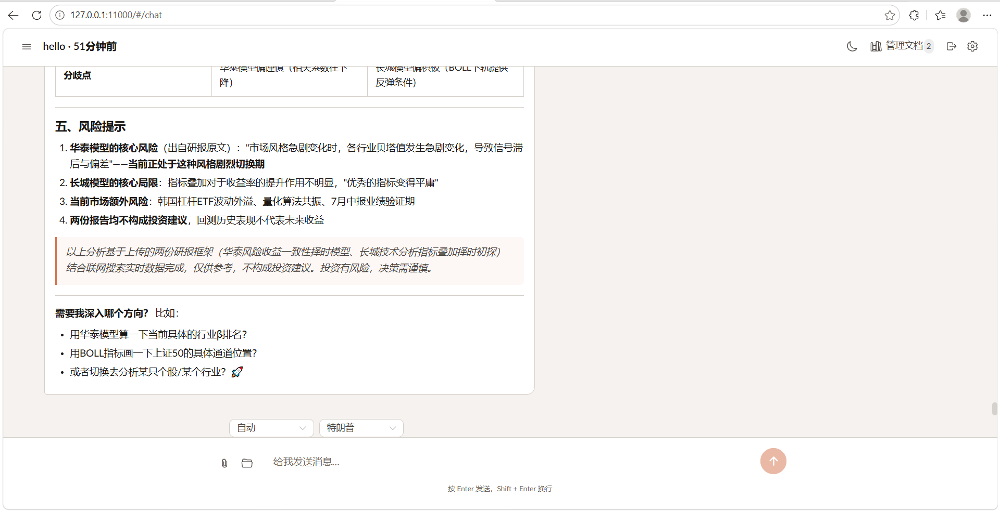
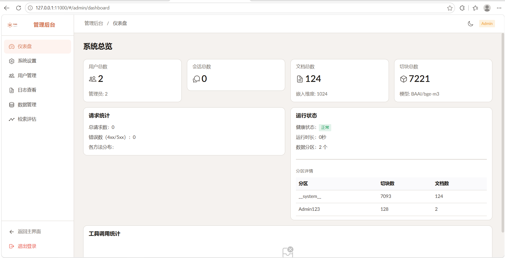

# RAG Simple

基于 FastAPI + LLM 的 RAG 知识问答系统，支持多工作流、工具调用、PDF 解析、向量检索、管理后台。

[]()
[]()
[]()
[]()

---

## 快速启动

### 前置条件

- Python 3.11+
- Node.js 18+
- MinerU API Key（PDF 解析）
- LLM API Key（对话 + 嵌入）

### 1. 安装后端

```bash
# 使用 uv（推荐）
uv sync

# 或 pip（从 pyproject.toml 安装）
pip install -e .
```

### 2. 配置

```bash
# 编辑 config.ini，填入必要配置
# 最小配置需要：
#   [api] chat_api_key / chat_base_url / chat_model
#   [api] embedding_api_key / embedding_base_url / embedding_model
#   [api] mineru_api_key（PDF 解析）

# 密钥也可通过 .env 或环境变量覆盖
```

参见 [配置说明](config.ini) 各段注释。

### 3. 启动服务

```bash
python app.py
# 服务启动于 http://0.0.0.0:11000
```

### 4. 构建前端（可选，也可使用开发模式）

```bash
cd web
npm install
npm run build        # 生产构建 → dist/
# 或 npm run dev     # 开发模式 localhost:5173
```

构建后的 `dist/` 会自动被 FastAPI 作为静态文件服务。

### 5. 访问

- **主页面**：`http://localhost:11000`
- **管理后台**：`http://localhost:11000/#/admin`
  - 使用 `config.ini` 中 `[superuser]` 配置的账号登录
  - 默认：`Admin123 / Admin123`

---

## 效果图

| 对话页 | 管理后台 |
|---|---|
|  |  |

---

## 项目架构

```
rag_simple/
│
├── agent/                       # Agent 引擎
│   ├── loop.py                  # ToolLoop: 工具调用循环核心
│   ├── integrate.py             # IntegratedSystem: 顶层集成入口
│   ├── state.py                 # AgentState: 运行时状态
│   ├── context.py               # SkillLoader / WorkflowRouter / SystemContext
│   ├── governor.py              # 上下文治理 (压缩/截断历史)
│   │
│   └── tools/                   # 工具系统
│       ├── registry.py          # 注册中心 + 14 个内建工具注册
│       ├── _kb_handlers.py      # 知识库工具 (检索/文档/全文搜索)
│       ├── _web_handlers.py     # 联网工具 (搜索/URL 读取)
│       ├── _infra_handlers.py   # 基础设施工具 (目标/状态/工作流)
│       ├── _format.py           # 检索结果格式化
│       └── cache.py             # 工具缓存
│
├── api/                         # HTTP 接口 (FastAPI)
│   ├── auth.py                  # JWT 认证
│   ├── query.py                 # 问答 (非流式 + SSE 流式)
│   ├── history.py               # 对话历史
│   ├── sessions.py              # 会话管理
│   ├── documents.py             # 文档上传/列表/图片
│   ├── deps.py                  # 鉴权依赖
│   └── admin/                   # 管理后台
│       ├── dashboard.py         #   仪表盘
│       ├── config.py            #   系统设置 (热更新)
│       ├── database.py          #   向量库管理 + 系统数据上传
│       ├── eval.py              #   检索质量评估
│       ├── logs.py              #   日志查看
│       └── users.py             #   用户管理
│
├── rag/                         # RAG 基础设施
│   ├── vector_store.py          # FAISS 向量存储 (检索/持久化/分区)
│   ├── pdf_parser.py            # MinerU PDF 解析
│   └── eval_rag.py              # 评估: LLM 评分 (0-4) + 精确率
│
├── base/                        # 全局基础设施
│   ├── config.py                # 三层配置加载 (ini + .env + 环境变量)
│   ├── llm_client.py            # OpenAI 兼容客户端
│   └── logger.py                # 结构化日志
│
├── storage/                     # 数据持久化
│   ├── json_store.py            # JSON 文件存储
│   └── base.py                  # 存储抽象基类
│
├── prompts/                     # 提示词模板
│   ├── identity.md              # 系统身份设定
│   ├── style/                   # 回答风格 (巴菲特/马斯克/Jobs 等)
│   └── workflow/                # 工作流 (简报/对比/深度研究等)
│
├── web/                         # Vue 3 前端
├── dist/                        # 前端构建产物
│
├── data/                        # 运行时数据 (向量库/历史/文档)
├── logs/                        # 日志文件
│
├── doc/                         # 文档
│   ├── architecture.md          #   架构总览
│   ├── agent.md                 #   Agent 引擎
│   ├── api.md                   #   API 接口
│   ├── rag.md                   #   RAG 基础设施
│   ├── base.md                  #   基础模块
│   ├── storage.md               #   存储层
│   ├── prompts.md               #   提示词系统
│   ├── tool.md                  #   工具文档
│   └── web.md                   #   前端
│
├── app.py                       # FastAPI 应用入口
├── config.ini                   # 配置文件
└── pyproject.toml               # 项目元数据 + 依赖
```

## 核心数据流

```
用户输入
  │
  ├─ 历史加载 → 超限自动压缩/截断 (governor)
  │
  ├─ 组装 system + history + query
  │
  ├─ LLM 工具循环 (ToolLoop)
  │   ├─ LLM 决定调工具 → 并发执行 → 结果回灌 → 继续
  │   └─ LLM 决定直接回答 → 返回最终答案
  │
  ├─ should_continue 检查
  │   ├─ 超迭代上限? → 保存状态, "继续"恢复
  │   └─ 超上下文窗口? → 中断
  │
  └─ 保存历史 → 返回答案
```

## 主要功能

| 功能 | 说明 |
|------|------|
| **多工作流** | 简报、对比、深度研究、自动规划、美股分析 |
| **工具调用** | 14 个工具，知识库检索(RRF融合) + 联网搜索 + 文档阅读 |
| **PDF 解析** | MinerU API (VLM/Lite)，自动提取文本/表格/图片 |
| **多风格回答** | 支持巴菲特、马斯克、Jobs 等回答风格 |
| **上下文治理** | 超预算自动压缩工具结果或截断旧历史 |
| **中断恢复** | 达工具上限后保存状态，"继续"即恢复 |
| **管理后台** | 配置热更新、向量库管理、检索质量评估、用户管理 |

---

## 桌面客户端

本应用可打包为原生 Windows 桌面客户端（基于 PyWebView + PyInstaller），用户双击即可使用，无需手动启动浏览器。

### 架构

```
┌────────────────────────────────┐
│  桌面窗口 (系统 WebView2)        │  ← Win10+ 自带，无需额外安装
│  ┌──────────────────────────┐  │
│  │  http://127.0.0.1:11000   │  │
│  └──────────────────────────┘  │
├────────────────────────────────┤
│  desktop.py                     │  ← 启动入口
│  ├─ 后台线程启动 uvicorn         │
│  └─ GUI 循环 (pywebview)        │
├────────────────────────────────┤
│  config.ini / data/             │  ← 外置，用户可编辑
└────────────────────────────────┘
```

### 依赖

```bash
# Python 端
uv pip install pywebview pyinstaller

# 前端（如需重新构建）
cd web
npm install
npm run build
```

### 开发模式运行

```bash
python desktop.py
```

直接弹出桌面窗口，无需打开浏览器。关闭窗口后后端自动退出。

### 打包为可分发 EXE

```powershell
.\scripts\build_desktop.ps1
```

脚本自动完成：
1. 检查 Python / uv 环境
2. `npm run build` 构建前端
3. PyInstaller 打包为 `build/rag-simple/rag-simple.exe`

也可跳过前端构建步骤（如 dist/ 已是最新）：

```powershell
.\scripts\build_desktop.ps1 -NoBuild
```

### 交付物结构

打包完成后，`build/rag-simple/` 目录即为可分发产物：

```
rag-simple/
├── rag-simple.exe        ← 双击启动
├── _internal/            ← Python 依赖库（PyInstaller 自动生成）
├── config.ini            ← 外置配置（用户可编辑）
├── .env.example          ← 环境变量参考
├── index.html            ← 前端页面
├── assets/               ← 前端静态资源
├── prompts/              ← 提示词模板
├── data/                 ← 运行时数据（首次启动自动创建）
└── logs/                 ← 日志（首次启动自动创建）
```

将整个目录复制到目标 Windows 电脑，放置好 `config.ini`，双击 `rag-simple.exe` 即可使用。

> **注意：** 目标电脑需为 **Windows 10 及以上**（系统自带 WebView2 运行时）。
> 首次启动可能稍慢（加载向量库与 LLM 客户端），请耐心等待。

### 打包为安装程序

可将 `build/rag-simple/` 进一步封装为 Windows 安装程序（`.exe`），用户安装后自动创建快捷方式、可卸载。

#### 1. 安装 Inno Setup

下载 [Inno Setup](https://jrsoftware.org/isdl.php)（免费，中文支持），使用默认选项安装即可。

#### 2. 编译安装包

```powershell
# 如果 iscc 已在 PATH 中
iscc scripts\installer.iss

# 否则用完整路径（版本号可能不同）
& "C:\Program Files\Inno Setup 7\ISCC.exe" scripts\installer.iss
& "C:\Program Files (x86)\Inno Setup 6\ISCC.exe" scripts\installer.iss
```

或在 Inno Setup IDE 中打开 `scripts/installer.iss` → **Compile**（或按 Ctrl+F9）。

输出：`build/installer/RAG-Simple-Setup-0.2.0.exe`

#### 3. 安装流程

用户双击安装包后：

```
选择安装路径 → 选择快捷方式 → 填写 API 密钥 → 安装 → 完成
```

安装过程中会显示 API 密钥配置页，支持字段：

| 字段 | 默认值 | 说明 |
|------|--------|------|
| 对话模型 API Key | — | **必填**，LLM 对话用 |
| 对话模型地址 | `https://opencode.ai/zen/go/v1` | — |
| 对话模型名称 | `deepseek-v4-flash` | — |
| 嵌入模型 API Key | — | 可选，向量化用 |
| 嵌入模型地址 | `https://api.siliconflow.cn/v1` | — |
| PDF 解析 API Key | — | 可选，MinerU 文档解析用 |
| PDF 解析 Base URL | `https://mineru.net/api/v4` | — |

填写的值会自动写入 `config.ini`，留空的字段保持包内默认值不变。

#### 4. 安装位置

```
%ProgramFiles%\RAG Simple\
├── rag-simple.exe
├── config.ini
├── index.html / assets/    ← 前端
├── prompts/                ← 提示词模板
└── _internal/              ← 依赖库
```

开始菜单生成「RAG Simple」和「卸载 RAG Simple」两个快捷项。控制面板 → 程序和功能中可卸载。卸载前自动关闭运行中的进程。

---

## 文档索引

| 文档 | 内容 |
|------|------|
| [架构总览](doc/architecture.md) | 整体架构、分层、数据流 |
| [Agent 引擎](doc/agent.md) | 工具循环、状态管理、工具注册 |
| [API 模块](doc/api.md) | HTTP 接口、路由、管理后台 |
| [RAG 基础设施](doc/rag.md) | 向量存储、PDF 解析、评估 |
| [基础模块](doc/base.md) | 配置加载、LLM 客户端、日志 |
| [存储层](doc/storage.md) | JSON 文件持久化 |
| [提示词系统](doc/prompts.md) | 身份、风格、工作流 |
| [工具文档](doc/tool.md) | 14 个工具的详细参数 |
| [前端](doc/web.md) | Vue 3 架构、页面路由 |

## 配置说明

详细配置项参见 [config.ini](config.ini) 各段注释。关键配置：

```ini
[api]
chat_api_key = sk-...        # 对话模型 API Key
chat_base_url = https://...  # 对话模型地址
chat_model = deepseek-v4-...

embedding_api_key = sk-...   # 嵌入模型 API Key
embedding_base_url = https://...
embedding_model = BAAI/bge-m3
embedding_dim = 1024

mineru_api_key = eyJ...      # PDF 解析 API Key
```

## 许可证

MIT
